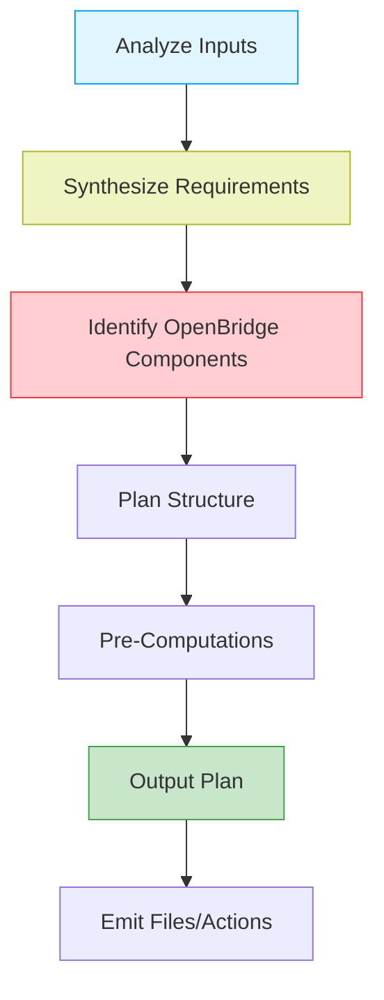

# Reasoning & Planning Process

## Implementation Workflow

## Required Planning Steps
1. **Visual Analysis** - Examine all visual references first
2. **Component Mapping** - Match UI elements to OpenBridge web components
3. **Dependency Graph** - Create import hierarchy for required modules
4. **Theme Strategy** - Plan palette handling and CSS variable usage
5. **Error Boundaries** - Identify potential compatibility issues
6. **Output Validation** - Verify against WebContainer constraints
